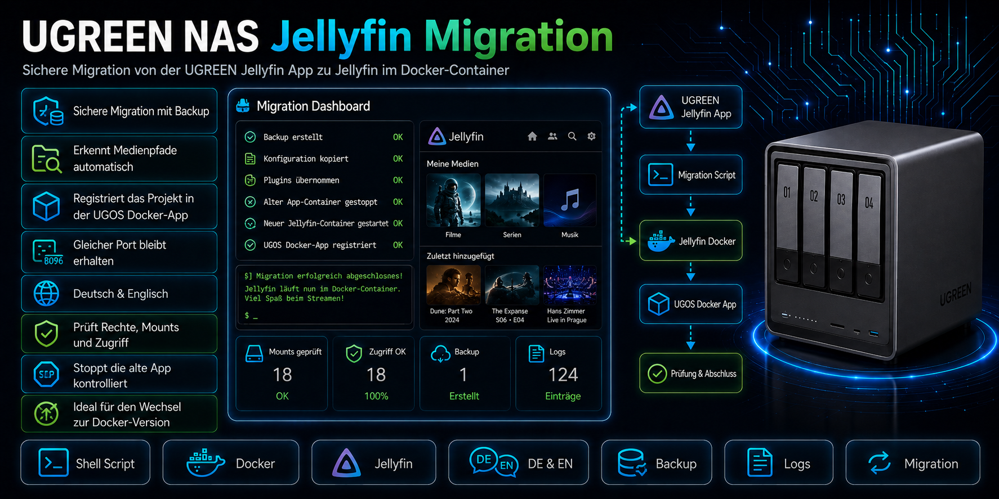
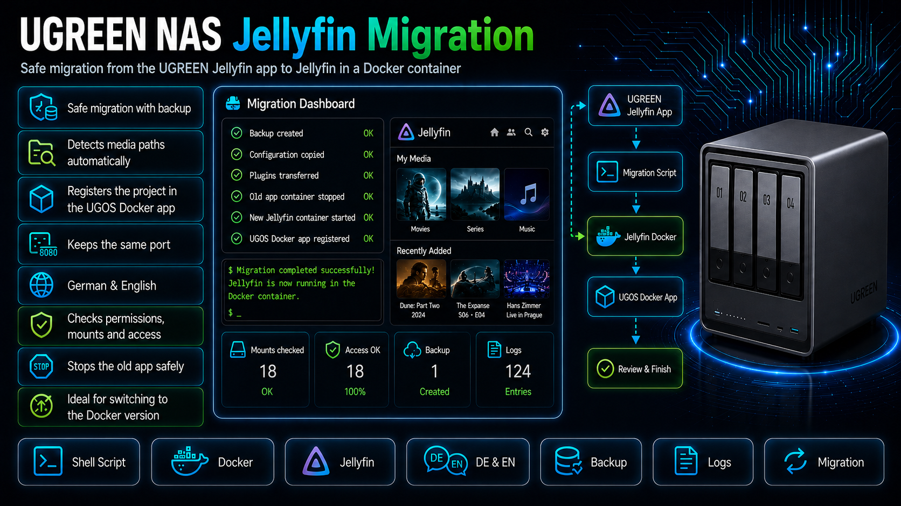

# UGREEN NAS Jellyfin Migration



Das **UGREEN NAS Jellyfin Migration Tool** ist ein leichtgewichtiges Migrationspaket für UGREEN NAS Systeme mit UGOS.  
Es migriert eine bestehende UGREEN App Center Jellyfin-Installation in ein normales Docker-Projekt und übernimmt dabei Konfiguration, Cache, Plugins und Medienpfade.

Das Ziel ist eine möglichst einfache und sichere Migration: Backup erstellen, alte UGREEN-Jellyfin-App stoppen, neues Docker-Projekt erzeugen und Jellyfin anschließend über die UGOS Docker-App weiter betreiben.

> **Hinweis:** Dieses Projekt ist eine Community-Lösung und kein offizielles UGREEN-Produkt. Verwendung auf eigene Verantwortung.

## Features

- Sichere Migration mit Backup
- Automatische Erkennung der alten UGREEN-Jellyfin-App
- Übernahme von Jellyfin-Konfiguration, Cache und Plugins
- Automatische Erkennung und Übernahme der vorhandenen Medienpfade
- Erzeugt ein neues UGOS-Docker-Projekt `jellyfin-docker`
- Registriert das Projekt in der UGOS Docker-App
- Stoppt die alte UGREEN-Jellyfin-App kontrolliert
- Setzt die Restart-Policy der alten App auf `no`
- Neuer Jellyfin-Container läuft nicht als root
- Prüft Medienzugriff, Mounts, `/config` und `/cache`
- Behält den bestehenden Jellyfin-Port bei
- Deutsch und Englisch in der Oberfläche des Scripts
- Ausführliches deutsch-englisches Handbuch als PDF im Release-Paket

## Projektstruktur

```text
UGREEN-NAS-Jellyfin-Migration/
|- README.md
|- Screens/
|  |- Jellyfin-Migration.png
|  |- Jellyfin-Migration1280.jpg
|  `- Jellyfin-MigrationEN.png
`- Release-Paket:
   |- UGREEN-NAS-Jellyfin-Migration-v1.0.0.zip
   `- UGREEN-NAS-Jellyfin-Migration_Handbuch_DE-EN.pdf
```

Das Release-Paket enthält das eigentliche Migrationsscript und das Handbuch:

```text
UGREEN-NAS-Jellyfin-Migration-v1.0.0/
|- .env
|- LICENSE
|- start.sh
`- VERSION
```

## Schnellstart auf einem UGREEN NAS

1. Release-Paket herunterladen.
2. ZIP-Datei entpacken.
3. Den entpackten Ordner auf das NAS kopieren, zum Beispiel nach:

```text
/volume1/docker/UGREEN-NAS-Jellyfin-Migration-v1.0.0
```

4. SSH in UGOS aktivieren.
5. Per PuTTY oder einem anderen SSH-Client mit dem NAS verbinden.
6. Root-Rechte holen:

```bash
sudo -i
```

7. In den Projektordner wechseln:

```bash
cd /volume1/docker/UGREEN-NAS-Jellyfin-Migration-v1.0.0
```

8. Optional zuerst einen Prüflauf starten:

```bash
./start.sh --check-only
```

9. Migration starten:

```bash
./start.sh
```

10. Nach erfolgreicher Migration Jellyfin im Browser öffnen und prüfen:

```text
http://<NAS-IP>:8899
```

Das Script zeigt nach der Migration nach Möglichkeit direkt die richtige NAS-IP an.

## Was macht das Script?

Das Script führt die Migration Schritt für Schritt aus:

1. Sprache auswählen
2. Root-Rechte prüfen
3. UGREEN-Jellyfin-App erkennen
4. vorhandene Medienpfade erkennen
5. UID/GID für den neuen Jellyfin-Container ermitteln
6. Medienzugriff im Testcontainer prüfen
7. Backup der alten UGREEN-Jellyfin-Daten erstellen
8. neues Docker-Projekt unter `/volumeX/docker/JellyfinDocker` erzeugen
9. alte UGREEN-Jellyfin-App stoppen
10. neuen Jellyfin-Container starten
11. Projekt in der UGOS Docker-App registrieren
12. Docker-App aktualisieren
13. Zugriffstest im laufenden Container durchführen
14. Abschlussbericht mit URL, Backup-Pfad und nächsten Schritten anzeigen

## Nach der Migration prüfen

Nach Abschluss der Migration bitte in Jellyfin prüfen:

- Login funktioniert
- Benutzer sind vorhanden
- Bibliotheken sind vorhanden
- Medienpfade stimmen
- Plugins sind vorhanden
- Wiedergabe funktioniert
- Transcoding funktioniert, falls verwendet

Wenn Jellyfin Plugin-Aktualisierungen meldet, sollte Jellyfin danach einmal neu gestartet werden.

## Alte UGREEN-Jellyfin-App

Die alte UGREEN-Jellyfin-App wird vom Script bewusst **nicht automatisch gelöscht**.

Wenn nach der Migration alles funktioniert, kann die alte App im UGREEN App Center deinstalliert werden:

```text
UGREEN App Center -> Jellyfin -> Deinstallieren
```

Wichtig:

- den neuen Docker-Projektordner nicht löschen
- das neue Docker-Projekt heißt `jellyfin-docker`
- der neue Projektordner liegt normalerweise unter `/volumeX/docker/JellyfinDocker`
- Backups zunächst aufbewahren

## Bekannte Hinweise

### Directory-Watcher-Warnung

Auf manchen Systemen kann Jellyfin nach der Migration eine Directory-Watcher-Warnung melden.  
Wenn der echte Zugriffstest des Scripts erfolgreich ist, betrifft das normalerweise nur die Echtzeitüberwachung der Bibliothek.

Normale Bibliotheksscans und Wiedergabe können trotzdem funktionieren.

### Root-eigene Metadaten

Die UGREEN-App kann Metadaten wie NFO-Dateien oder Poster als root erzeugt haben.  
Das Script erkennt solche Dateien und prüft den tatsächlichen Zugriff. Wenn der Zugriff erfolgreich ist, werden keine Medienrechte automatisch verändert.

### Cache und Transcodes

Temporäre Transcode-Dateien unter `/cache/transcodes` werden beim Backup übersprungen.  
Das ist beabsichtigt, da diese Dateien während der Wiedergabe laufend geändert werden können.

## Dokumentation

Das ausführliche deutsch-englische Handbuch liegt als PDF im Release-Paket bei.

Es beschreibt unter anderem:

- SSH in UGOS aktivieren
- Verbindung mit PuTTY herstellen
- Release per SMB auf das NAS kopieren
- Prüflauf starten
- Migration starten
- Ergebnis in der UGOS Docker-App prüfen
- Jellyfin prüfen
- alte UGREEN-Jellyfin-App deinstallieren

## Download

Bitte das aktuelle Release über GitHub herunterladen:

```text
Releases -> UGREEN-NAS-Jellyfin-Migration-v1.0.0.zip
```

## Version

- UGREEN NAS Jellyfin Migration Tool: **v1.0.0**
- Zielsystem: UGREEN NAS mit UGOS
- Getestet auf: DXP4800PRO
- Neuer Docker-Projektname: `jellyfin-docker`
- Neuer Projektordner: `/volumeX/docker/JellyfinDocker`

## English note



The **UGREEN NAS Jellyfin Migration Tool** is a lightweight migration package for UGREEN NAS systems running UGOS.  
It migrates an existing UGREEN App Center Jellyfin installation to a normal Docker project and transfers configuration, cache, plugins and media paths.

The goal is a simple and safe migration: create a backup, stop the old UGREEN Jellyfin app, create a new Docker project and continue running Jellyfin through the UGOS Docker app.

### Main features

- Safe migration with backup
- Automatic detection of the old UGREEN Jellyfin app
- Transfers Jellyfin configuration, cache and plugins
- Detects and keeps existing media paths
- Creates a new UGOS Docker project named `jellyfin-docker`
- Registers the project in the UGOS Docker app
- Stops the old UGREEN Jellyfin app safely
- Runs the new Jellyfin container as a non-root user
- Checks media access, mounts, `/config` and `/cache`
- Keeps the existing Jellyfin port
- German and English script interface
- Full German-English PDF manual included in the release package

### Quick start

1. Download the release package.
2. Extract the ZIP file.
3. Copy the extracted folder to the NAS, for example:

```text
/volume1/docker/UGREEN-NAS-Jellyfin-Migration-v1.0.0
```

4. Enable SSH in UGOS.
5. Connect to the NAS using PuTTY or another SSH client.
6. Become root:

```bash
sudo -i
```

7. Change into the project folder:

```bash
cd /volume1/docker/UGREEN-NAS-Jellyfin-Migration-v1.0.0
```

8. Optional check-only run:

```bash
./start.sh --check-only
```

9. Start the migration:

```bash
./start.sh
```

10. After migration, open Jellyfin in the browser and verify users, libraries, media paths, plugins and playback/transcoding.

The old UGREEN Jellyfin app is intentionally not removed automatically.  
After a successful check, uninstall the old app manually in the UGREEN App Center.

## License and usage

This project is licensed under the **PolyForm Noncommercial License 1.0.0**.

- Noncommercial use is allowed
- Commercial use is not allowed
- Commercial use requires prior written permission from the author

For commercial use, please contact the author in advance.

## Copyright

Copyright (c) 2026 Roman Glos / Railsimulatornet
